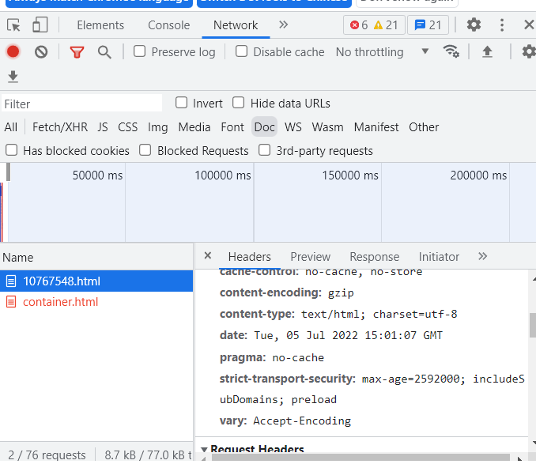
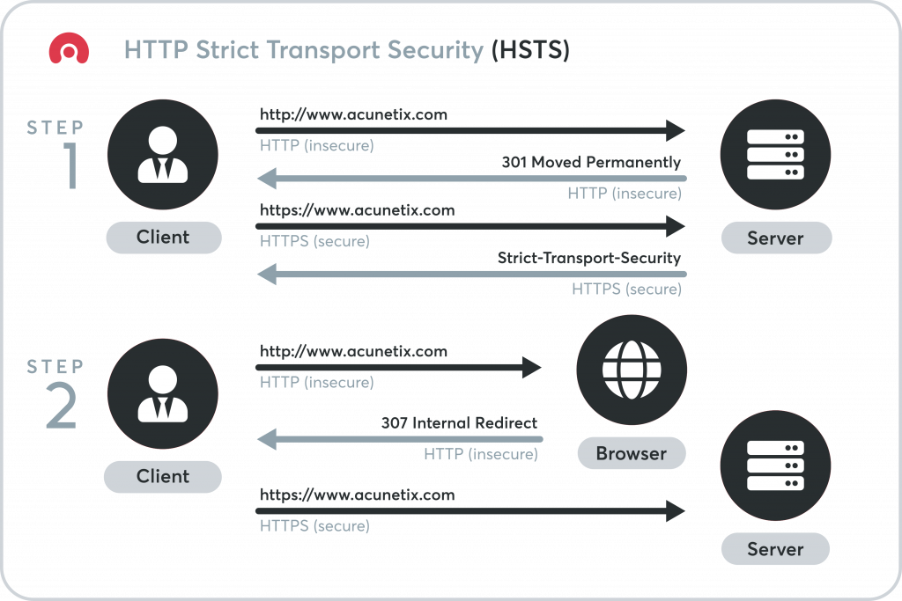

# HSTS #

HSTS(HTTP Strict Transport security)策略是一种建立在HTTPS上更加严格的安全策略，启用它的网站将会使域中所有的连接形式都以HTTPS进行，即使有HTTP式的连接，通过一次307跳转也会被转换成HTTPS。可以通过查看Response头里是否有字段 strict-transport-security 来确认：

max-age后面的数字代表持续时间，259200代表2天，是必选参数，但可以填0.持续时间内的请求都会被转换成HTTPS

includeSubDomains代表域下所有子域都应用了该策略

preload代表开启了更安全的预加载功能。因为用户可能因为 手动输入http/浏览器 一开始就没有访问到https，这种情况下，就仍然可能会遇到中间人攻击。而预加载功能的开启就避免了这种情况，网址将被加入到chrome的一份名单中，即使当用户第一次访问的是HTTP，chrome会进行一次301跳转，将网址正确地导向HTTPS。EDGE、FireFox等主流浏览器也有相关功能 

该策略于2012年被定义在网络安全策略 RFC 6797中

参考：

[https://www.cnblogs.com/upyun/p/10767548.html](https://www.cnblogs.com/upyun/p/10767548.html "HSTS 详解，让 HTTPS 更安全")

[https://https.cio.gov/hsts/](https://https.cio.gov/hsts/ "HTTP Strict Transport Security")